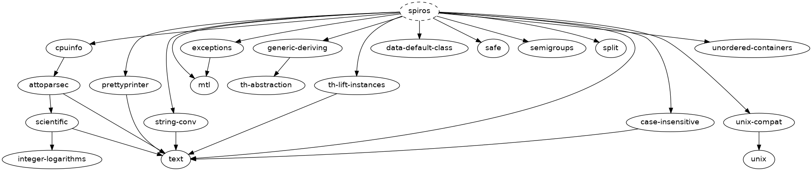

[](http://travis-ci.org/sboosali/spiros)
[](https://hackage.haskell.org/package/spiros)

# `spiros`

## Description

My custom `Prelude`.

Who I am:

* `sboo` on Hackage (<https://hackage.haskell.org/user/sboo>).
* `@sboosali` on GitHub (<https://github.com/sboosali/>).
* `/u/spirosboosalis` on Reddit.

## Features

Features:

* /Portability/:

    * JavaScript         — tested under GHCJS (`ghcjs-8.4._`).
    * Static-Linking     — tested against `musl` for Static Linking (and with `glibc`, obviously).
    * GHC Compatibility  — tested under multiple GHCs (from GHC 7.10 (`ghc-7.10.3`) to GHC 8.6 (`ghc-8.6.3`).
    * OS Compatibility   — tested on Linux, Windows, and MacOS (should work on FreeBSD and Android too, since I removed the `clock` dependency; please file an issue if you know that it doesn't).
 
* /Convenience/:

    * `Prelude.Spiros` exports hundreds of functions, types, and classes without naming conflicts (renaming or triaging as necessary).

Utilities include:

* `Prelude.Spiros.Exception`   — /Safe/ partial functions, via `MonadThrow`.
* `Prelude.Spiros.Parse`       — Parsing `Enum`s.
* `Prelude.Spiros.Print`       — Pretty-Printing `Enum`s.
* `Prelude.Spiros.Validator`   — Validation `Applicative` (with both “errors” and “warnings”).
* `Prelude.Spiros.Application` — Application-specific `XDG BaseDirs` (for a conformant @executable@),
* `Prelude.Spiros.System`      — Information about the runtime platform.

## Usage

For a @library@:

``` haskell
import "spiros" Prelude.Spiros
```

For a @*-types@ package:

``` haskell
import "spiros" Prelude.Spiros.Classes
```

For an @executable@:

``` haskell
import "spiros" Prelude.Spiros
import "spiros" Prelude.Spiros.System
import "spiros" Prelude.Spiros.Application
```

<!--
For a @test-suite@:

``` haskell
import "spiros" Prelude.Spiros
import "spiros" Prelude.Spiros.Testing
```
-->

## Requires...

Explicit Dependencies (Haskell):

* `exceptions`
* `data-default-class`
* `th-lift-instances`
* `generic-deriving`
* `prettyprinter`
* `unordered-containers`
* `string-conv`
* `case-insensitive`
* `split`
* `cpuinfo`
* `unix-compat`

Transitive Dependencies (Haskell):

* `attoparsec`
* `scientific`
* `integer-logarithms`
* `th-abstraction`

Graph:



Dependencies (C):

* `libffi`

(NOTE these Haskell libraries (/Boot packages/ and /Wired-In packages/) and these system libraries are required by GHC itself (and thus are almost always necessary dependencies for any Haskell program, as far as I know.)

GHC Dependencies (C):

* `glibc` or `musl`
* `gmp` or `integer-simple`

GHC Dependencies (Haskell):

* `base`
* `bytestring`
* `containers`
* `deepseq`
* `directory`
* `filepath`
* `mtl`
* `process`
* `stm`
* `template-haskell`
* `text`
* `time`
* `transformers`
* `unix` or `Win32`
* `integer-gmp` or `integer-simple`

## Required By...

Reverse Dependencies (Haskell)

[Reverse Dependencies](http://packdeps.haskellers.com/reverse/spiros)

Dependent projects include:

* the `enumerate*` packages — `enumerate`, `enumerate-function`.
* the `dication*`  packages — `dication`, `dictation-server`, `dictation-simple`, `dictation-tools`, `natlink-client-dll`.
* the `workflow*`  packages — `workflow`, `workflow-types`, `workflow-x11-shell`, `workflow-windows`, `workflow-osx`, `workflow-pure`.
* the `skeletor*`  packages — `skeletor`, `skeletor-types`, `skeletor-haskell`, `skeletor-elisp`, `skeletor-nix`.
* the `mtg*`       packages — `mtg-types`, `mtg-json`, `mtg-csv`, `mtg-sql`, `mtg-search`, `mtg-scryfall`, `mse`.

Other dependent packages include:

* `desktop-entry-files`
* `emacs-types`
* `genovation-control-pad`
* `kbd`
* `licenses`
* `reflex-fltk`

Some of these are /works in progress/. If you're interested in contributing to any of them, note that the utilities in `spiros` (and the dependencies mentioned) are available to use (and encouraged to be used).

## Development

The `Makefile` has these standard targets:

* `make build`   — invokes `cabal new-build -fdevelop`.
* `make check`   — invokes `cabal new-test --enable-tests`.
* `make install` — invokes `cabal new-install`.
* `make dist`    — invokes `cabal new-sdist`.

... and these custom targets:

* `make static`    — builds with `-fstatic`. evals `./static/default.nix` (which links `ghc` against `musl` and [TODO] `integer-simple`).
* `make develop`   — builds with `-fdevelop`. 
* `make publish` – invokes `git tag`. invokes `cabal new-upload --publish`, which publishes to Hackage, and `curl`s `/repos/sboosali/spiros/releases`, which publishes to GitHub.
* `make docs`      — invokes `cabal new-haddock --enable-documentation`.
* `make checkdocs` — invokes `cabal new-test --enable-tests` on all `doctest`s.
* `make bench`     — invokes `cabal new-bench --enable-benchmarks`.

## Implementation

### Conditional-Compilation

See `./spiros/include/sboo-base-feature-macros.h` for named macros (inspired by `@hvr`'s `base-feature-macros.h`).

Compiler Macros:

* `#define IS_COMPILER_ghc`
* `#define IS_COMPILER_ghcjs`

Operating-System Macros:

* `#define IS_OS_LINUX`
* `#define IS_OS_WINDOWS`
* `#define IS_OS_APPLE`

Architecture Macros:

* `#define IS_ARCH_64_BIT_INTEL`
* `#define IS_ARCH_32_BIT_INTEL`

`base` Macros:

* `#define HAS_APPLICATIVE_MONAD`
* `#define HAS_BASE_BINARY_LIFTED_CLASSES`
* `#define HAS_BASE_Bifoldable_Bitraversable`
* `#define HAS_BASE_Bifunctor`
* `#define HAS_BASE_Contravariant`
* `#define HAS_BASE_Functors`
* `#define HAS_BASE_Identity`
* `#define HAS_BASE_MonadIO`
* `#define HAS_BASE_Natural`
* `#define HAS_BASE_NonEmpty`
* `#define HAS_BASE_Semigroup`
* `#define HAS_BASE_UNARY_LIFTED_CLASSES`
* `#define HAS_FOLDABLE_TRAVERSABLE_IN_PRELUDE`
* `#define HAS_GHC_CallStack`
* `#define HAS_METHOD_Exception_displayException`
* `#define HAS_MONAD_FAIL`
* `#define HAS_PRELUDE_Monoid`
* `#define HAS_PRELUDE_OPERATOR_Append`

GHC Extension Macros:

* `#define HAS_EXTENSION_DeriveAnyClass`
* `#define HAS_EXTENSION_DeriveFunctor`
* `#define HAS_EXTENSION_DerivingLift`
* `#define HAS_EXTENSION_DuplicateRecordFields`
* `#define HAS_EXTENSION_DerivingStrategies`

GHC Pragma Macros:

* `#define HAS_PRAGMA_COMPLETE`

Package Macros:

* `#define HAS_HASHABLE_Hashable1`
* `#define HAS_HASHABLE_Hashable2`
* `#define HAS_DEEPSEQ_NFData1`
* `#define HAS_DEEPSEQ_NFData2`

## 